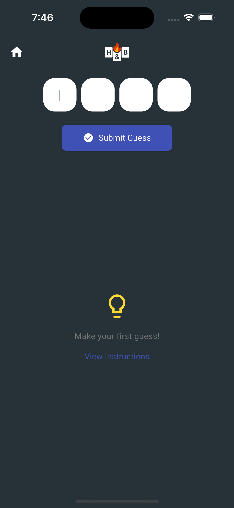

# Hits & Blows 🔢🔥

**Hits & Blows** is a fun, minimalist logic game where you guess a secret code made up of unique digits. Challenge yourself to deduce the correct number in the fewest attempts possible!

## 🕹️ Gameplay

- The game generates a secret code with unique digits (e.g. 4-digit number).
- You enter a guess using the input fields.
- You receive feedback in the form of:
  - **Hits** (correct digit, correct position)
  - **Blows** (correct digit, wrong position)
- Keep guessing until you get all digits in the right place!

## ✨ Features

- Clean, modern UI
- Light animations and sound effects
- Three difficulty levels: Easy, Medium, Hard
- History of guesses with feedback
- Works offline — all data is stored locally
- Designed for mobile and tablet

## 📱 Screenshots

### Home Screen


### Instructions Screen


### Mode Select Screen


### Game Screen


### Game In Progress


## 🚀 Getting Started

To run the app locally:

```bash
flutter pub get
flutter run
```

## 🧪 Testing

```bash
flutter test           # Run unit tests
```

## 📦 Installation

Available soon on:

- [Google Play Store](#)
- [Apple App Store](#)

## 🔒 Privacy

We do **not** collect or store any personal data. See [Privacy Policy](./hits_and_blows_privacy_policy.md) for more info.

## 🛠️ Built With

- [Flutter](https://flutter.dev/)
- [Riverpod](https://riverpod.dev/)
- [GoRouter](https://pub.dev/packages/go_router)
- [Flutter Pinput](https://pub.dev/packages/pinput)

## 🙌 Contributing

Pull requests are welcome! For major changes, please open an issue first to discuss what you'd like to change.

## 📬 Contact

Questions, ideas, or feedback?  
Email: **[support@jabtech.com.au]**

---

**Enjoy cracking the code!**
